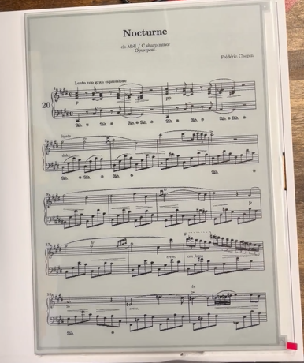

# EinkSheetMusic

> This repo contains code for the EinkSheetMusic tablet.

## 🌟Highlights
- Light and portable
- Easy access to PDF sheet music
- No more carrying around stacks of paper music or bright LCDs

## ℹ️ Overview
1. **esp32_app**: Renders .bin images on the Good Display ESP32-L Series e-ink driver board from a connected SD card.
2. **pdf_to_bin_app**: Converts PDFs to .bin image files. Has server and web interface as well as command-line executable.

## 🚀 Usage
> [!NOTE]
> Additional READMEs for the **esp32_app** and **pdf_to_bin_app** are in each respective folder.

1. Flash the driver board with the **esp32_app** .ino
2. Convert desired PDFs to .bin files with the **pdf_to_bin_app**
3. Use a USB flash drive to load output .bin files to the tablet's SD card.
4. Insert the SD card and read music on the tablet!

