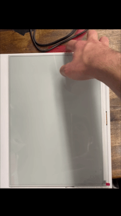

# ESP32 App

Code for rendering .bin image data on a Good Display ESP32-L Series E-ink driver board using GXEPD2.

## ℹ️ Overview
> *TODO: Organize into multiple files and classes for extensibility*
1. **esp32_app.ino**: The C++ code to flash to the ESP32. Renders .bin files from the connected SD card.

## 🚀Usage
1. Flash the driver board with the .ino file
2. Use the PDF to .bin converter and a USB drive to load desired .bin files to the SD card.
3. Turn the tablet on and use the buttons for page turns (right and left) and sleep mode.
4. Recharge using the Micro USB port on the back of the tablet and enjoy!

