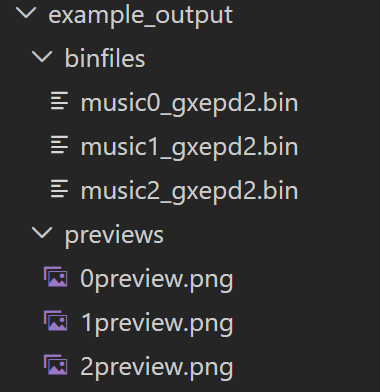

# PDFtoBin E-ink Image Converter

A C++ PDF to bitmap image converter for the GXEPD2 e-ink display library. It is integrated with a Python FastAPI server for a web GUI and will soon be able to host an HTTP server to serve image files to requesting ESP32-based e-ink driver boards.

## ℹ️ Overview

1. **C++ converter_app**: Dithers and packs the PDF data to a bitmap to be displayed on GXEPD2 e-ink screens.
2. **Python FastAPI Server**: Provides a web GUI to remotely upload PDFs (output bitmaps stored locally) 
3. **(In-Progress) ESP32 Integration**: Provides an HTTP server to serve image bitmaps to a requesting ESP32 e-ink board.

## 🛠️Dependencies

*C++ converter_app Dependencies*
* **Poppler C++** [libpoppler-cpp-dev](https://poppler.freedesktop.org/api/cpp/).
* Filesystem library (`<filesystem>`).

*Python web GUI Dependencies*
* FastAPI
* Uvicorn

## 🚀 Usage

*Web GUI*
1. Start ./server/main.py
2. Connect to the appropriate machine IP
3. Upload PDF files and see bitmap results!

*C++ converter_app*

1. Run the executable, passing the output directory and input PDF as arguments.
```shell
.\build\PDFtoBin.exe "./binfiles" "nocturne.pdf"   
```
   It should give something like:
```
TOTAL_PAGES:3
PROGRESS_PAGE:1
PROGRESS_PAGE:2
PROGRESS_PAGE:3
```

2. Check the output folder for binfiles and dithered png previews!
   

